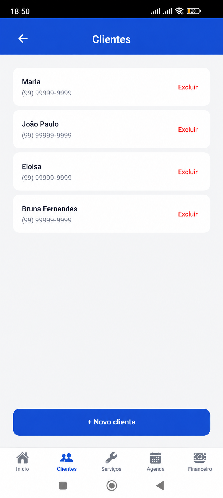
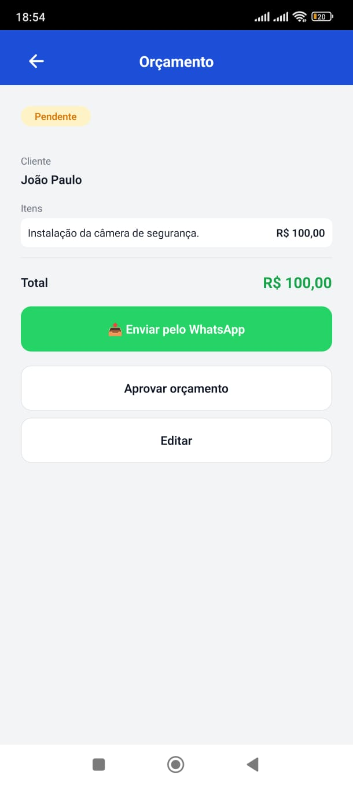
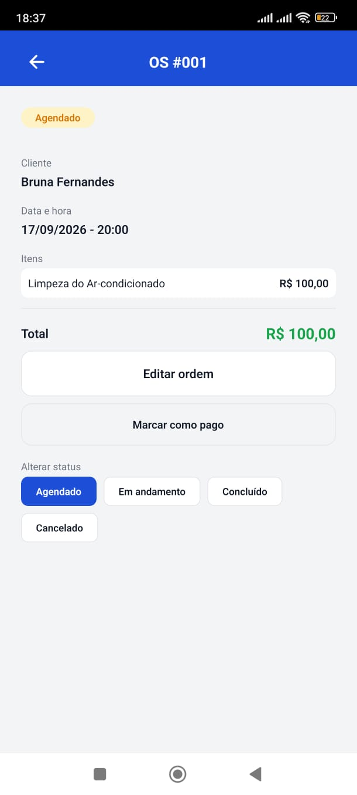
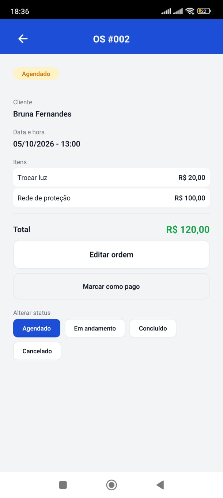
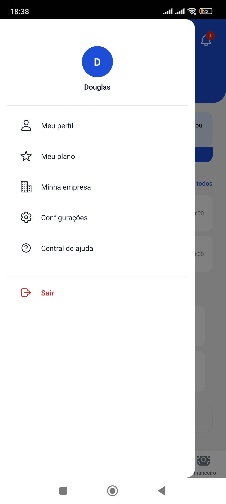

<div align="center">


# Ordem Fácil

**Gestão de serviços para profissionais autônomos, direto do celular.**

Cadastre clientes, monte orçamentos, gere ordens de serviço e acompanhe tudo em um só lugar.

</div>

## Sobre o projeto

O Ordem Fácil é um aplicativo mobile para profissionais que trabalham em campo, como eletricistas, técnicos de manutenção, instaladores, entre outros. Ele cobre o caminho completo do atendimento: do primeiro contato com o cliente até o recebimento, sem planilhas nem papelada.

O projeto foi construído do zero, passo a passo, com React Native, Expo e Firebase, e já está em fase de teste fechado na Google Play.

## Funcionalidades

- **Clientes:** cadastro com WhatsApp, e-mail e endereço, com preenchimento automático por CEP (API ViaCEP).
- **Catálogo de serviços:** serviços com valor padrão, reaproveitados nos orçamentos e nas ordens.
- **Orçamentos:** itens do catálogo ou avulsos, total calculado automaticamente e envio da proposta pelo WhatsApp.
- **Aprovação:** ao aprovar um orçamento, a ordem de serviço é criada automaticamente, sem digitar tudo de novo.
- **Ordens de serviço:** numeração sequencial, status (agendado, em andamento, concluído, cancelado), edição e controle de pagamento.
- **Agenda:** atendimentos agrupados por dia, em ordem de data e hora.
- **Dashboard com "Próximo passo":** avisa o que precisa de atenção, como atendimentos atrasados, orçamentos parados há mais de 2 dias e compromissos do dia.
- **Notificações:** central dentro do app, com contador de não lidas.
- **Financeiro:** recebido, a receber, despesas e lucro (recurso do plano Profissional).
- **Planos:** Gratuito (5 clientes, 3 ordens e 3 orçamentos por mês) e Profissional (sem limites). A cobrança da assinatura pela Google Play ainda não está ativa.
- **Resiliência:** checagem de conexão antes de salvar, com mensagem clara quando não há internet.

## Tecnologias

- **React Native** e **Expo**, com **TypeScript**
- **React Navigation**: abas inferiores, menu lateral e pilha de telas
- **Firebase Authentication**: login e cadastro com e-mail e senha
- **Cloud Firestore**: banco de dados, com regras de segurança por usuário
- **NetInfo**: checagem de conexão antes de salvar
- **EAS Build**: geração do build de produção para a Google Play

## Como rodar o projeto

Você precisa do Node.js instalado e de um projeto no [Firebase](https://console.firebase.google.com) com Authentication (e-mail e senha) e Firestore ativados.

1. Clone o repositório e entre na pasta:

```bash
git clone https://github.com/maycon-douglasd/ordem-facil.git
cd ordem-facil
```

2. Instale as dependências:

```bash
npm install
```

3. Crie o arquivo de variáveis a partir do exemplo:

```bash
cp .env.example .env
```

4. Abra o `.env` e preencha as 6 variáveis com as chaves do **seu** projeto Firebase (Firebase Console > Configurações do projeto > Seus apps).

5. Inicie o app:

```bash
npx expo start
```

6. Escaneie o QR code com o app **Expo Go** no celular.

## Configuração do Firestore

O app usa as coleções `clientes`, `servicos`, `orcamentos`, `ordens_servico`, `usuarios`, `notificacoes` e `despesas`. Cada documento guarda o `donoId` do usuário, e as regras de segurança só permitem acesso ao dono. As listagens usam ordenação por `criadoEm`, então o Firestore pede índices compostos (`donoId` crescente e `criadoEm` decrescente). Ao rodar o app pela primeira vez, o erro no terminal traz o link para criar cada índice.

## Telas

<p align="center">
  
  
  
</p>

<p align="center">
  
  
  
</p>